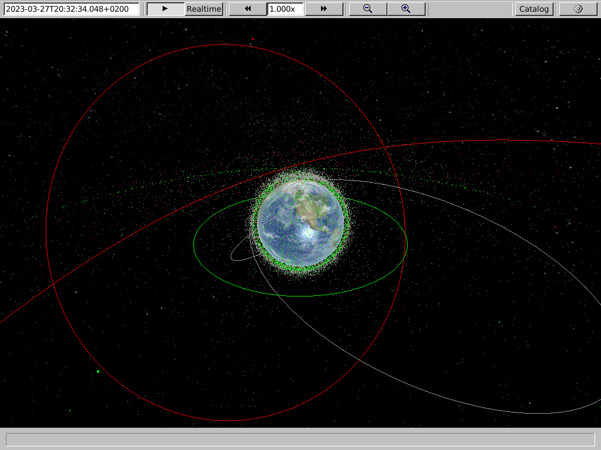
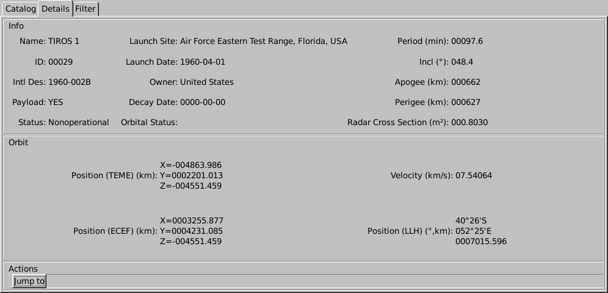

# Orbit Visualizer

View and propagate the full CelesTrak satellite catalog in realtime.




## Build

### Linux (FlatHub)

<a href='https://flathub.org/apps/details/io.github.wojciech_graj.OrbVis'></a>

### Linux (Compile from source)

The following packages have to be installed prior to compilation: `gcc pkg-config gtk+-3.0 libcurl epoxy meson`. On Debian-based systems, run the following command to install them:
```
apt-get install gcc pkg-config libgtk-3-dev libcurl4-openssl-dev libepoxy-dev meson
```

To compile:
```
meson builddir
meson compile -C builddir
```
To run the program:
```
cd builddir
./orbvis
```

### Windows

Windows binaries are provided with github releases. These releases provide the executable `bin/orbvis.exe`, which cannot be moved from the directory structure, but a shortcut can be created and used.

If you wish to compile for windows yourself, use MSYS2. First verify that all required packages are installed by calling `util/wininit.sh`, then compile with `util/winbuild.sh`. This creates the `release` directory containing windows binaries and all other required files.

## License

```
Copyright (c) 2022-2023 Wojciech Graj

This program is free software; you can redistribute it and/or
modify it under the terms of the GNU General Public License
as published by the Free Software Foundation; either version 2
of the License, or (at your option) any later version.

This program is distributed in the hope that it will be useful,
but WITHOUT ANY WARRANTY; without even the implied warranty of
MERCHANTABILITY or FITNESS FOR A PARTICULAR PURPOSE.  See the
GNU General Public License for more details.
```

Portions of this software are copyright of their respective authors:
- [stb](https://github.com/nothings/stb), Licensed under the [MIT License](https://opensource.org/licenses/MIT); Copyright (c) 2017 Sean Barrett
- [hashmap.c](https://github.com/tidwall/hashmap.c), Licensed under the [MIT License](https://opensource.org/licenses/MIT); Copyright (c) 2020 Joshua J Baker
- [sgp4](https://github.com/aholinch/sgp4), Licensed under the [Unlicense](https://opensource.org/licenses/Unlicense)
- [satcat](https://github.com/wojciech-graj/libSATCAT), Licensed under the [MIT License](https://opensource.org/licenses/MIT); Copyright (c) 2022 Wojciech Graj
- [libcurl](https://curl.se/libcurl/), Licensed under the [curl license](https://curl.se/docs/copyright.html); Copyright (c) 1996 - 2022, Daniel Stenberg, and many contributors
- [cglm](https://github.com/recp/cglm), Licensed under the [MIT License](https://opensource.org/licenses/MIT); Copyright (c) 2015 Recep Aslantas
- [epoxy](https://github.com/anholt/libepoxy), Licensed under the [MIT License](https://opensource.org/licenses/MIT); Copyright (c) 2013-2014 Intel Corporation
- [Khronos OpenGL API](https://cvs.khronos.org/svn/repos/ogl/trunk/doc/registry/public/api/); Copyright (c) 2013 The Khronos Group Inc.
- [Gtk+3](https://gtk.org/), Licensed under the [LGPL-2.1+ License](https://opensource.org/licenses/LGPL-2.1)
